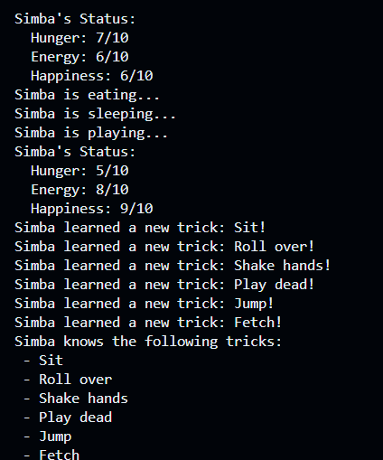

# OOP-Challenge: Pet Class

A simple Python project that demonstrates basic Object‑Oriented Programming by modeling a pet with attributes and behaviors. You’ll be able to:

- Track your pet’s **hunger**, **energy**, and **happiness**
- Make your pet **eat**, **sleep**, and **play**
- **Train** your pet to learn new tricks and display them

---

## 🔧 How to Use

1. **Clone the repo:**
   ```bash
   git clone https://github.com/willy-havertz/python-oop-challenge.git
   cd python-oop-challenge

2. **Running**
  Run main.py in your terminal

  
---

## 📸 Screenshot 




